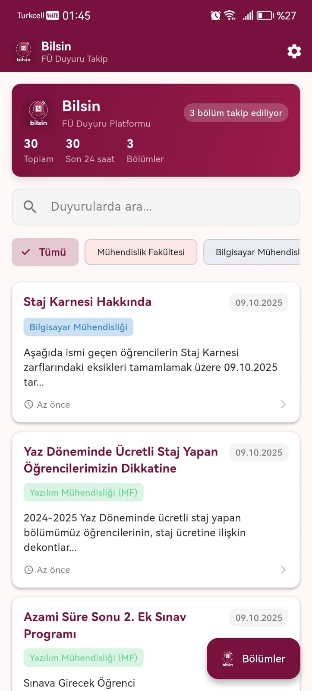
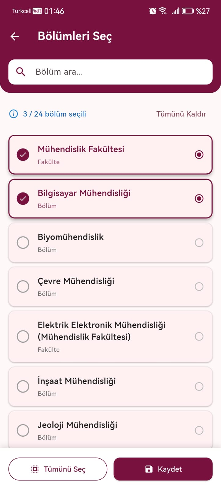

# 📱 Bilsin - Fırat Üniversitesi Duyuru Takip Uygulaması

> "Hiçbir duyuruyu kaçırma!" - Fırat Üniversitesi öğrenci ve personeli için güvenilir duyuru takip uygulaması.

  <!-- Gerçek ekran görüntüleri -->
  
  
  
  

---

## 🎯 Bilsin Nedir?

Bilsin, Fırat Üniversitesi’nin 24 farklı bölümünden gelen duyuruları tek uygulamada toplayan mobil uygulamadır. Takip etmek istediğiniz bölümleri seçer, yeni duyurularda anında bildirim alırsınız.

---

## 🏛️ Hangi Bölümler Takip Ediliyor?

Uygulama; Mühendislik ve Teknoloji Fakültelerindeki 24 mühendislik bölümünü takip eder. (Detay: `functions/src/departmentLinks.ts`)

> Not: Bu sürüm bir MVP’dir. Zamanla diğer fakülteler de eklenecektir.

---

## 🔔 Özellikler

- Anlık push bildirimleri (seçtiğiniz bölümler için)
- Gelişmiş arama ve filtreleme
- Bölüm bazlı renkler, paylaşıma açma, webde açma
- Skeleton loading ile hızlı ve modern arayüz
- Dark Mode (Açık/Koyu/Sistem) ve kalıcı tema seçimi
- Remote Config ile sürüm kontrolü (önerilen/zorunlu güncelleme diyaloğu)

---

## 🆕 Son Sürüm Notları (v1.1.1)

- Dark Mode desteği eklendi (Açık/Koyu/Sistem)
- Ayarlardan kalıcı tema seçimi (shared_preferences)
- Koyu modda kartlar, arama çubukları, chip’ler ve alt buton alanları iyileştirildi
- Remote Config ile sürüm kontrolü (GitHub Releases APK yönlendirmesi)
- UI okunabilirlik/kontrast düzeltmeleri

Önceki sürüm (v1.1.0):
- Test fonksiyonları (sendTestNotification, directFCMTest, debugFirestore)
- 15 dakikada bir “son duyuru” kontrolü ve bildirim
- Duplikasyon azaltma, paylaşım/link ve performans iyileştirmeleri

---

## 🔒 Güvenlik ve Gizlilik

- Firebase altyapısı, SSL/TLS, Anonymous Auth
- Kişisel veri toplanmaz; yalnızca anonim UID ve FCM token
- Bölüm tercihleri, yalnızca bildirim filtrelemede kullanılır
- Veriler 3. şahıslarla paylaşılmaz

---

## 📥 İndirme ve Kurulum

### Hızlı İndirme

- Android 5.0+ (API 21+)
- “Bilinmeyen kaynaklar” iznini verin, APK’yı yükleyin
- Uygulamayı açıp bildirim izni verin, bölümlerinizi seçin

---

## ⚙️ Bildirim Koşulları

- Uygulamada bildirim izni verilmeli
- Firestore `kullanicilar/{uid}` içinde geçerli `fcm_token` bulunmalı
- Takip edilen bölüm(ler)de yeni duyuru yayınlanmalı
- Manuel eklenen duyurular bildirim tetiklemez

---

## 👨‍💻 Geliştirici ve İletişim

- Geliştirici: Fatih Altuntaş (Fırat Üniversitesi öğrencisi)
- Email: altuntasfatih0@outlook.com
- Issues: https://github.com/Conquerorr0/bilsin/issues

---

## 📄 Lisans

MIT — detaylar için [LICENSE](LICENSE).